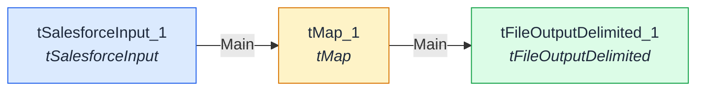

# CRM_Export_Prospects

Exporte chaque semaine les prospects qualifiés du CRM vers un fichier utilisé par l'outil d'emailing pour la campagne marketing.

| Champ | Valeur |
|---|---|
| Propriétaire | Equipe Marketing Ops |
| Version | _Non renseigné_ |
| Planification | Hebdomadaire - lundi 06:00 |
| Source du parsing | manual |

## Systèmes source

- CRM Salesforce

## Systèmes cible

- Outil Emailing (Mailjet)

## Schéma du flux

Diagramme généré automatiquement (Mermaid)

## Composants

| Nom | Type | Description |
|---|---|---|
| tSalesforceInput_1 | tSalesforceInput | Extraction des comptes prospects qualifiés (statut = "Qualifié") |
| tMap_1 | tMap | Normalisation des colonnes (email, prénom, nom, segment) |
| tFileOutputDelimited_1 | tFileOutputDelimited | Génération du fichier CSV de campagne |

## Connexions

| De | Vers | Type | Nature |
|---|---|---|---|
| tSalesforceInput_1 | tMap_1 | Main | Flux principal |
| tMap_1 | tFileOutputDelimited_1 | Main | Flux principal |

## Notes

Vérifier le filtre de qualification avant chaque campagne pour éviter
d'exporter des doublons ou des contacts désabonnés.
