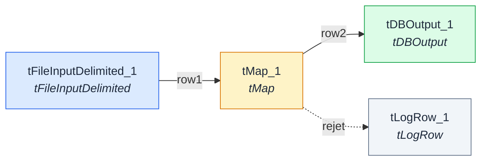

# DWH_Load_Clients

Synchronise quotidiennement les clients du CRM vers l'entrepôt de données (DWH).

| Champ | Valeur |
|---|---|
| Propriétaire | corentin.poirier |
| Version | 0.1 |
| Planification | _Non renseigné_ |
| Source du parsing | item |

## Objectif métier

Alimenter le référentiel clients pour le reporting BI.

## Systèmes source

_Non renseigné_

## Systèmes cible

_Non renseigné_

## Schéma du flux

_Aucune capture d'écran associée à ce job (dépose une image nommée `DWH_Load_Clients.png` dans le dossier `screenshots/`)._

## Composants

| Nom | Type | Description |
|---|---|---|
| tFileInputDelimited_1 | tFileInputDelimited | Lit le fichier CSV des clients exporté par le CRM |
| tMap_1 | tMap | Nettoyage et mapping des colonnes clients |
| tDBOutput_1 | tDBOutput | Insertion dans la table clients de l'entrepôt de données |
| tLogRow_1 | tLogRow | _Non renseigné_ |

## Connexions

| De | Vers | Type | Nature |
|---|---|---|---|
| tFileInputDelimited_1 | tMap_1 | row1 | Flux principal |
| tMap_1 | tDBOutput_1 | row2 | Flux principal |
| tMap_1 | tLogRow_1 | rejet | Rejet |
