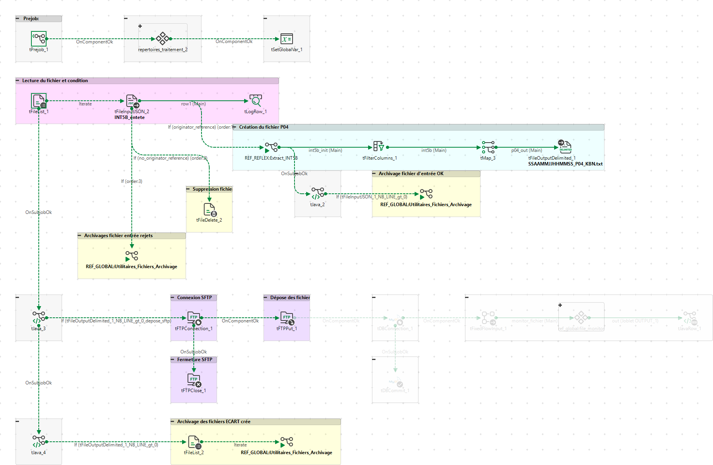

# reflex_file_movex_sftp_kanban_p04

| Champ | Valeur |
|---|---|
| Propriétaire | _Non renseigné_ |
| Version | 0.1 |
| Planification | _Non renseigné_ |
| Source du parsing | item |

## Systèmes source

_Non renseigné_

## Systèmes cible

_Non renseigné_

## Schéma du flux

```mermaid
flowchart LR
    tPrejob_1["tPrejob_1<br/><i>tPrejob</i>"]
    repertoires_traitement_2["repertoires_traitement_2<br/><i>ref_global:repertoires_traitement</i>"]
    tSetGlobalVar_1["tSetGlobalVar_1<br/><i>tSetGlobalVar</i>"]
    tFTPConnection_1["tFTPConnection_1<br/><i>tFTPConnection</i>"]
    tJava_3["tJava_3<br/><i>tJava</i>"]
    tFTPClose_1["tFTPClose_1<br/><i>tFTPClose</i>"]
    tFTPPut_1["tFTPPut_1<br/><i>tFTPPut</i>"]
    tJava_4["tJava_4<br/><i>tJava</i>"]
    tFileList_2["tFileList_2<br/><i>tFileList</i>"]
    tRunJob_1["tRunJob_1<br/><i>tRunJob</i>"]
    tRunJob_2["tRunJob_2<br/><i>tRunJob</i>"]
    tFileList_1["tFileList_1<br/><i>tFileList</i>"]
    tFileInputJSON_2["tFileInputJSON_2<br/><i>tFileInputJSON</i>"]
    tLogRow_1["tLogRow_1<br/><i>tLogRow</i>"]
    tFileDelete_2["tFileDelete_2<br/><i>tFileDelete</i>"]
    tRunJob_4["tRunJob_4<br/><i>tRunJob</i>"]
    tRunJob_5["tRunJob_5<br/><i>tRunJob</i>"]
    tFilterColumns_1["tFilterColumns_1<br/><i>tFilterColumns</i>"]
    tMap_3["tMap_3<br/><i>tMap</i>"]
    tFileOutputDelimited_1["tFileOutputDelimited_1<br/><i>tFileOutputDelimited</i>"]
    tJava_2["tJava_2<br/><i>tJava</i>"]
    tDBConnection_1["tDBConnection_1<br/><i>tMysqlConnection</i>"]
    tDBCommit_1["tDBCommit_1<br/><i>tMysqlCommit</i>"]
    tFixedFlowInput_1["tFixedFlowInput_1<br/><i>tFixedFlowInput</i>"]
    file_monitor_1["file_monitor_1<br/><i>ref_global:file_monitor</i>"]
    tJavaRow_1["tJavaRow_1<br/><i>tJavaRow</i>"]
    tPrejob_1 ==>|OnComponentOk| repertoires_traitement_2
    repertoires_traitement_2 ==>|OnComponentOk| tSetGlobalVar_1
    tFTPConnection_1 ==>|OnSubjobOk| tFTPClose_1
    tFTPConnection_1 ==>|OnComponentOk| tFTPPut_1
    tJava_3 ==>|OnSubjobOk| tJava_4
    tJava_3 ==>|tFileOutputDelimited_1_NB_LINE_gt_0_depose_sftp| tFTPConnection_1
    tFTPPut_1 ==>|OnComponentOk| tDBConnection_1
    tJava_4 ==>|tFileOutputDelimited_1_NB_LINE_gt_0| tFileList_2
    tFileList_2 -.->|Iterate| tRunJob_1
    tFileList_1 -.->|Iterate| tFileInputJSON_2
    tFileList_1 ==>|OnSubjobOk| tJava_3
    tFileInputJSON_2 -->|row1| tLogRow_1
    tFileInputJSON_2 ==>|originator_reference| tRunJob_5
    tFileInputJSON_2 ==>|no_originator_reference| tFileDelete_2
    tFileInputJSON_2 ==>|If| tRunJob_4
    tRunJob_5 -->|int5b_init| tFilterColumns_1
    tRunJob_5 ==>|OnSubjobOk| tJava_2
    tFilterColumns_1 -->|int5b| tMap_3
    tMap_3 -->|p04_out| tFileOutputDelimited_1
    tJava_2 ==>|tFileInputJSON_1_NB_LINE_gt_0| tRunJob_2
    tDBConnection_1 ==>|OnComponentOk| tFixedFlowInput_1
    tDBConnection_1 ==>|OnSubjobOk| tDBCommit_1
    tFixedFlowInput_1 -->|monitor_fichier| file_monitor_1
    file_monitor_1 -->|out| tJavaRow_1
    classDef orchestration fill:#EDE9FE,stroke:#7C3AED,stroke-width:1px,color:#1e293b;
    class tPrejob_1,repertoires_traitement_2,tSetGlobalVar_1,tFTPConnection_1,tFTPClose_1,tRunJob_1,tRunJob_2,tRunJob_4,tRunJob_5,tDBConnection_1,tDBCommit_1,file_monitor_1 orchestration;
    classDef transform fill:#FEF3C7,stroke:#D97706,stroke-width:1px,color:#1e293b;
    class tJava_3,tJava_4,tFilterColumns_1,tMap_3,tJava_2,tJavaRow_1 transform;
    classDef target fill:#DCFCE7,stroke:#16A34A,stroke-width:1px,color:#1e293b;
    class tFTPPut_1,tFileDelete_2,tFileOutputDelimited_1 target;
    classDef source fill:#DBEAFE,stroke:#2563EB,stroke-width:1px,color:#1e293b;
    class tFileList_2,tFileList_1,tFileInputJSON_2,tFixedFlowInput_1 source;
    classDef other fill:#F1F5F9,stroke:#64748B,stroke-width:1px,color:#1e293b;
    class tLogRow_1 other;
```

Diagramme généré automatiquement (Mermaid)

## Composants

| Nom | Type | Description |
|---|---|---|
| tPrejob_1 | tPrejob | _Non renseigné_ |
| repertoires_traitement_2 | ref_global:repertoires_traitement | _Non renseigné_ |
| tSetGlobalVar_1 | tSetGlobalVar | _Non renseigné_ |
| tFTPConnection_1 | tFTPConnection | _Non renseigné_ |
| tJava_3 | tJava | _Non renseigné_ |
| tFTPClose_1 | tFTPClose | _Non renseigné_ |
| tFTPPut_1 | tFTPPut | _Non renseigné_ |
| tJava_4 | tJava | _Non renseigné_ |
| tFileList_2 | tFileList | _Non renseigné_ |
| tRunJob_1 | tRunJob | _Non renseigné_ |
| tRunJob_2 | tRunJob | _Non renseigné_ |
| tFileList_1 | tFileList | _Non renseigné_ |
| tFileInputJSON_2 | tFileInputJSON | _Non renseigné_ |
| tLogRow_1 | tLogRow | _Non renseigné_ |
| tFileDelete_2 | tFileDelete | _Non renseigné_ |
| tRunJob_4 | tRunJob | _Non renseigné_ |
| tRunJob_5 | tRunJob | _Non renseigné_ |
| tFilterColumns_1 | tFilterColumns | _Non renseigné_ |
| tMap_3 | tMap | _Non renseigné_ |
| tFileOutputDelimited_1 | tFileOutputDelimited | _Non renseigné_ |
| tJava_2 | tJava | _Non renseigné_ |
| tDBConnection_1 | tMysqlConnection | _Non renseigné_ |
| tDBCommit_1 | tMysqlCommit | _Non renseigné_ |
| tFixedFlowInput_1 | tFixedFlowInput | _Non renseigné_ |
| file_monitor_1 | ref_global:file_monitor | _Non renseigné_ |
| tJavaRow_1 | tJavaRow | _Non renseigné_ |

## Connexions

| De | Vers | Type | Nature |
|---|---|---|---|
| tPrejob_1 | repertoires_traitement_2 | OnComponentOk | Déclencheur (OnSubjobOk/RunIf...) |
| repertoires_traitement_2 | tSetGlobalVar_1 | OnComponentOk | Déclencheur (OnSubjobOk/RunIf...) |
| tFTPConnection_1 | tFTPClose_1 | OnSubjobOk | Déclencheur (OnSubjobOk/RunIf...) |
| tFTPConnection_1 | tFTPPut_1 | OnComponentOk | Déclencheur (OnSubjobOk/RunIf...) |
| tJava_3 | tJava_4 | OnSubjobOk | Déclencheur (OnSubjobOk/RunIf...) |
| tJava_3 | tFTPConnection_1 | tFileOutputDelimited_1_NB_LINE_gt_0_depose_sftp | Déclencheur (OnSubjobOk/RunIf...) |
| tFTPPut_1 | tDBConnection_1 | OnComponentOk | Déclencheur (OnSubjobOk/RunIf...) |
| tJava_4 | tFileList_2 | tFileOutputDelimited_1_NB_LINE_gt_0 | Déclencheur (OnSubjobOk/RunIf...) |
| tFileList_2 | tRunJob_1 | Iterate | Itération |
| tFileList_1 | tFileInputJSON_2 | Iterate | Itération |
| tFileList_1 | tJava_3 | OnSubjobOk | Déclencheur (OnSubjobOk/RunIf...) |
| tFileInputJSON_2 | tLogRow_1 | row1 | Flux principal |
| tFileInputJSON_2 | tRunJob_5 | originator_reference | Déclencheur (OnSubjobOk/RunIf...) |
| tFileInputJSON_2 | tFileDelete_2 | no_originator_reference | Déclencheur (OnSubjobOk/RunIf...) |
| tFileInputJSON_2 | tRunJob_4 | If | Déclencheur (OnSubjobOk/RunIf...) |
| tRunJob_5 | tFilterColumns_1 | int5b_init | Flux principal |
| tRunJob_5 | tJava_2 | OnSubjobOk | Déclencheur (OnSubjobOk/RunIf...) |
| tFilterColumns_1 | tMap_3 | int5b | Flux principal |
| tMap_3 | tFileOutputDelimited_1 | p04_out | Flux principal |
| tJava_2 | tRunJob_2 | tFileInputJSON_1_NB_LINE_gt_0 | Déclencheur (OnSubjobOk/RunIf...) |
| tDBConnection_1 | tFixedFlowInput_1 | OnComponentOk | Déclencheur (OnSubjobOk/RunIf...) |
| tDBConnection_1 | tDBCommit_1 | OnSubjobOk | Déclencheur (OnSubjobOk/RunIf...) |
| tFixedFlowInput_1 | file_monitor_1 | monitor_fichier | Flux principal |
| file_monitor_1 | tJavaRow_1 | out | Flux principal |

## Paramètres de contexte

_Les valeurs (hôtes, identifiants, chemins...) sont masquées par défaut car potentiellement sensibles ; seuls les noms de paramètres sont listés._

| Nom | Valeur |
|---|---|
| repertoire_depose_sftp | •••• (masqué) |
| uncreflex_folderpath_out | •••• (masqué) |
| resource_flow_temp_folder | •••• (masqué) |
| connection_uncreflex_host | •••• (masqué) |
| connection_uncreflex_share_directory | •••• (masqué) |
| depose_sftp | •••• (masqué) |
| flow_name | •••• (masqué) |
| flow_workspace | •••• (masqué) |
| flow_environment | •••• (masqué) |
| connection_sftp_auth_method | •••• (masqué) |
| connection_sftp_encoding | •••• (masqué) |
| connection_sftp_host | •••• (masqué) |
| connection_sftp_passphrase_key | •••• (masqué) |
| connection_sftp_password | •••• (masqué) |
| connection_sftp_port | •••• (masqué) |
| connection_sftp_private_key | •••• (masqué) |
| connection_sftp_username | •••• (masqué) |
| connection_uncetl_host | •••• (masqué) |
| connection_uncetl_share_directory | •••• (masqué) |
| uncetl_filename_in | •••• (masqué) |
| uncetl_folderpath_archives | •••• (masqué) |
| uncetl_folderpath_in | •••• (masqué) |
| uncetl_folderpath_out | •••• (masqué) |
| connection_mssqlreflex_AdditionalParams | •••• (masqué) |
| connection_mssqlreflex_Database | •••• (masqué) |
| connection_mssqlreflex_Login | •••• (masqué) |
| connection_mssqlreflex_Password | •••• (masqué) |
| connection_mssqlreflex_Port | •••• (masqué) |
| connection_mssqlreflex_Schema | •••• (masqué) |
| connection_mssqlreflex_Server | •••• (masqué) |
| connection_mssqlreflex_SharedConnection | •••• (masqué) |
| connection_mysqlappglobal_Login | •••• (masqué) |
| connection_mysqlappglobal_Server | •••• (masqué) |
| connection_mysqlappglobal_Port | •••• (masqué) |
| connection_mysqlappglobal_AdditionalParams | •••• (masqué) |
| connection_mysqlappglobal_Password | •••• (masqué) |
| connection_mysqlappglobal_Database | •••• (masqué) |
| connection_mysqlappglobal_SharedConnection | •••• (masqué) |
